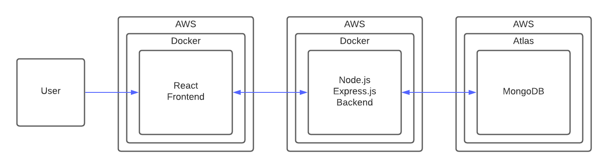
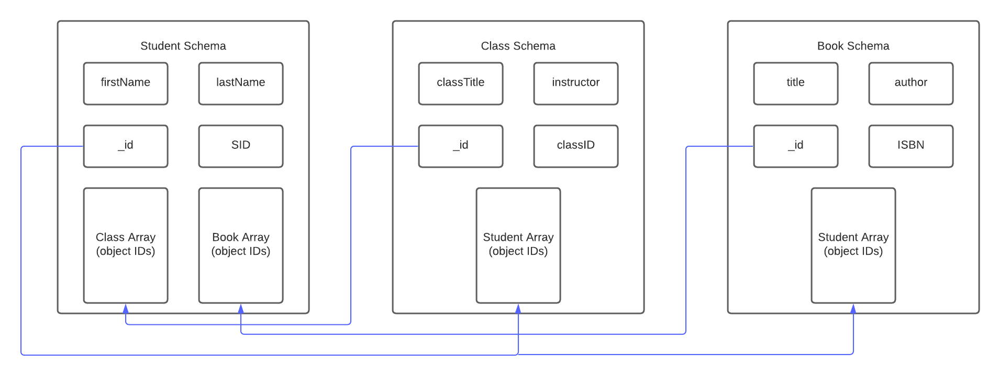

# MockUni
CMPE172 Project. Mock Uni is a university and library management system that allows an admin user to view, add, edit, and delete students, books, and classes.

The main goal of this project was to create a an easy to use and visually appealing system. We noticed that a lot of management systems are not that user firendly. THey give the user too many options and that could confuse the user. We know that each option serves a purpose, but for our project we wanted to keep it simple with a straight forward design.

Public AWS Link for Testing:
http://ec2-13-57-14-177.us-west-1.compute.amazonaws.com:3000/

University: San Jose State University

Class: CMPE 172 Section 01 - Enterprise Software

Team Members:
  - John Suico (012091885)
    - Student frontend and backend
    - Docker
    - Deployment to AWS
  - Atul Murali (012015562)
    - Book frontend and backend
  - Steven Vuong (011363560)
    - Class frontend and backend


## Table of Contents
- [Requirements](#requirements)
- [Cloning the Repository](#cloning-the-repo)
  - [Windows](#windows)
  - [Mac](#mac)
- [Docker installation](#running-the-web-application-locally-using-docker)
  - [Windows](#windows-scripts)
  - [Mac](#mac-scripts)
  - [Notes](#notes-about-running-locally)
  - [Browser Acess](#accessing-the-local-instance)
- [Tech Stack](#tech-stack)
- [System Diagram](#system-diagram)
- [Database Schema](#database-schema)
- [Dependencies](#dependencies)

## Requirements
- [Download Node](https://nodejs.org/en/download/)
- [Download Git](https://git-scm.com/downloads)
- [Download Docker](https://www.docker.com/products/docker-desktop)

## Cloning the Repo
The following instructions will place the repo on your desktop. Feel free to put the repo anywhere you want.

### Windows ###
- Open Powershell or CMD (Powershell Preferred)
- Go into desktop directory 

  ``` cd Desktop  ```
- Clone the MockUni repo

  ``` git clone https://github.com/johnsuico/MockUni.git ```
- Go into MockUni Directory

### Mac ###
- Open Terminal
- Go into desktop directory

  ``` cd Desktop  ```
- Clone the MockUni repo

  ``` git clone https://github.com/johnsuico/MockUni.git ```
- Go into MockUni Directory

## Running the web application locally using docker
The following instructions will teach you how to run the set up scripts for both Windows PCs and Mac machines to run the application with docker.

Both machines are similar in their steps to run the scripts

### Windows Scripts ###
- After cloning the repository, open the MockUni folder
- Go into the scripts folder
- Open the Windows Scripts folder
- Double click on the following scripts in any order:
  - `MockUni-Clent-Build-Script.bat`
  - `MockUni-Api-Build-Script.bat`
- You have now successfully created docker images in your machine! Now in order to run both of the images at the same time you will now have to double click on the following script:
  - `MockUni-Compose-All.bat`

### Mac Scripts ###
- After cloning the repository, open the MockUni folder
- Go into the scripts folder
- Open the Mac Scripts folder
- Before running any of the scripts there is an extra step we have to do in order to make the scripts executables
  - Read the `readme.txt` inside the Mac Scripts folder or continue reading to see similar information
  - cd into the Mac Scripts folder
    Example (in my case):

    `cd Projects/MockUni/Scripts/Mac\ Scripts/`

  - Run the following commands in your terminal of choice
    - `chmod u+x MockUni-Client-Build-Script.command`
    - `chmod u+x MockUni-Api-Build-Script.command`
    - `chmod u+x MockUni-Compose.command`
  - You are now able to run the scripts
- You have now successfully created docker images using the scripts. To run both images at the same time double click on the following script:
  - `Mockuni-Compose.command`

### Notes about running locally
The react image is not connected to the local instance of the API. It is connect to the AWS instance online.

When starting the images, the react client will take some time before it is ready. It will show warning about 404s and then say `starting the development server`. Wait until that is done and then you'll be able to use the react client in your browser

### Accessing the local instance
- Frontend
  - To access the react client open your browser of choice
  - Go to
    - `http://localhost:3000/`

- Backend
  - To access the API open your browser of choice
  - Go to
    - `http://localhost:5000/`

## Tech Stack
This project uses the MERN stack

- MongoDB
  - Our database
  - Created using MongoDB Atlas and hosted on AWS
- Express
  - Node web application framework
- React
  - Frontend library
- Node
  - Javascript runtime
- Docker
  - Project requirement
  - To run each tier inside a docker image
- AWS
  - Hosting service for our application
  - Used ECR and ECS
    - ECR was used to create a repository that stored the docker iamge
    - ECS instance was used to host the container

## System Diagram ##


## Database Schema ##


## Dependencies

- Backend
  - CORS
    - To allow for resource sharing between backend and frontend
  - Express
    - Backend framework
  - Mongoose
    - To handle database connections and queries

- Backend Dev
  - Nodemon
    - To restart the server on save instead of restarting the server manually

- Frontend
  - Axios
    - To make request to the backend server
  - react-icons
    - To use icons in our applicaiton
  - react-router-dom
    - To create different pages for our application
  - react-chartjs-2
    - To create bar graphs for analytics
  - chart.js
    - To create bar graphs for analytics
